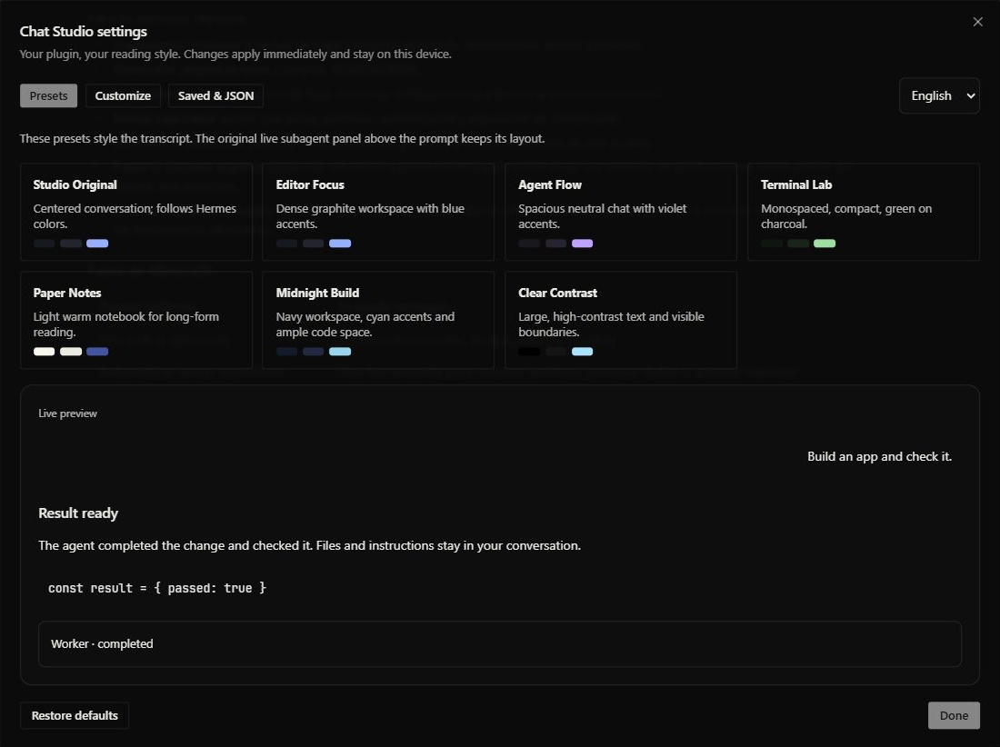

# Chat Studio

An offline conversation customization plugin for **Hermes Agent Desktop**.
Open its own **Chat Studio** button in the title bar, pick a style with one
click, or make your own. No model calls, API keys or backend service required.



## What you can change

- Seven original presets: Studio Original, Editor Focus, Agent Flow, Terminal
  Lab, Paper Notes, Midnight Build and Clear Contrast.
- Reading width, text size, line height, turn and paragraph spacing.
- System, book/serif or monospaced text; heading and code sizes.
- User message alignment, maximum width, bubbles and corner radius.
- Tool-card density and borders; wrapping of long code lines.
- Six custom transcript colors: background, cards, text, secondary text,
  links/accent and borders.
- A live preview, up to twelve saved personal styles, and configuration
  export/import as JSON. English and Spanish UI.

The presets are original layouts and palettes for reading and programming
workflows. They are not branded copies of other IDEs or bundled Hermes plugins.

The **original live subagent panel above the prompt retains its layout**.
Messages, tool results, errors, attachments and reasoning controls stay intact.
These preferences style the transcript; they do not recolor the entire app or
configure agent models, prompts, permissions or memory.

## Install

```sh
hermes plugins install https://github.com/gchablemeneses-web/hermes-chat-studio
```

Enable Chat Studio in **Capabilities → Plugins**. Desktop loads the
`desktop/plugin.js` entrypoint of this unified package. No JavaScript build or
Python dependencies are required. Requires Hermes `>=0.21.5` with the documented
Desktop SDK.

Do not keep a second standalone `desktop-plugins/chat-studio/plugin.js` copy
beside this package: Desktop plugin IDs are unique. If upgrading from the older
disk distribution, move that standalone folder to your own backup location
before enabling the unified package.

## Configure

Click **Chat Studio** in the title bar, or use the command palette:
**Chat Studio: Configure conversation**.

1. **Presets** applies a complete reading style with one click.
2. **Customize** adjusts individual controls immediately.
3. **Saved & JSON** stores personal styles or copies/imports configuration.
4. **Restore defaults** restores the original centered style and follows the
   current Hermes colors, while keeping your saved personal styles.

Settings persist on the current device through plugin-scoped SDK storage and
survive closing the panel or reloading the plugin. Desktop plugins are app-level,
so these reading preferences apply to the chats shown by that app window.
Disable the plugin to remove its CSS, button and palette command.

## Privacy and behavior disclosure

- No network calls, model calls, telemetry, shell commands or background work.
- No reading of conversations, files, credentials, browser profiles, model
  configuration or another plugin's data.
- Only `ctx.storage` stores the plugin's appearance preferences and saved styles.
- Only an explicit **Copy configuration JSON** click writes these preferences
  to the clipboard. Import reads text you paste into the plugin's own textarea.
- No core patches, app DOM queries, observers, injected scripts or private stores.
  React mounts the style and settings UI through the documented title-bar slot;
  the command uses `PALETTE_AREA`.
- CSS is scoped to the transcript's `data-slot` hooks; `.aui-md` and
  `.composer-human-message` currently identify its Markdown and user bubbles.
  A future markup change may require a reviewed plugin update.
- Custom colors and sizes are bounded and validated. Your own palette can have
  low contrast; Clear Contrast provides a readable starting point.

## Verification

The package has a React DOM behavior suite for preset application, customization,
persistence, JSON handling, CSS scope, write failure, teardown and reload. It
also runs the official `hermes plugins validate` admission checks.

```sh
npm ci
npm test
hermes plugins validate . --install-deps
```

The automated DOM suite is separate from testing real clicks in Hermes.exe.
Release screenshots use a synthetic demonstration conversation, not private
user chats or account data.

## Catalog status

Submitting a catalog PR requests human review. Publication of this repository
does not imply that Nous Research has admitted or endorsed the plugin.

## License

MIT. This is an independent community plugin for Hermes Desktop.
